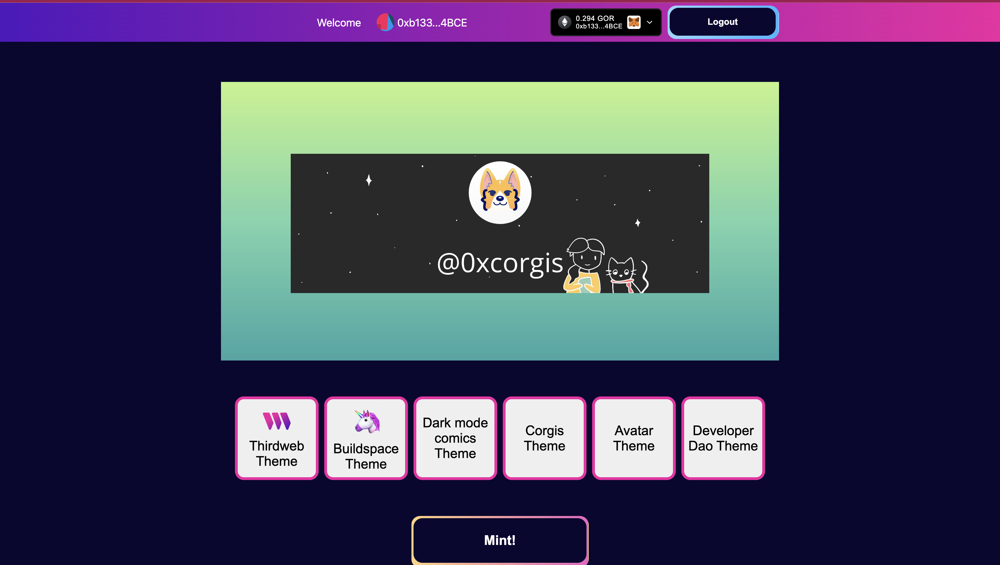

##  Twitter PFP to NFT Converter Example

This guide will show you how to create a **Twitter** PFP to **NFT** Converter. 

Had a blast building this **Twitter** profile nft project!

This showcase **nextauth** + **thirdweb sdk** to demonstate a **Twitter** profile pfp with custom themes background (web3 companies like **Developer DAO**, **buildspace** and **Dark mode Comics**) into a **NFT** using custom animations from  using **rive** 

Hope you enjoy! Happy Hacking!

## 🎥  Live Demo Video 👇
<a href="https://www.loom.com/share/fd377222f0fb420b8c5f6f00c2c29389">
    
  </a>

 [Check out loom video link  👉  Video Demo Link](https://www.loom.com/share/fd377222f0fb420b8c5f6f00c2c29389)

#### 📸 Screenshots 📸
 



## Demo 🔛
* [Frontend Demo link](https://twitter-profile-nft-converter-uta4.vercel.app/)
* [Backend API to generate custom theme background](https://twitter-profile-nft-converter-backend-kfrs.vercel.app/)


### What you need to get started:
* 💚 [**Node. js**](https://nodejs.org/en/) installed on your computer 💻 **node >=10.0.0** or **yarn >=1.0.0**
[Yarn]()
* 🦊 [Metamask wallet](https://metamask.io/) 👛
* Have **Goerli Testnet**  AND faucet ETH 🚰 in your Metamask  [right here](https://goerlifaucet.com/);

### Getting Started 🎮 

Create a project using this example:

```bash
cd twitter-profile-nft-converter
```

```bash
npm install 
or 
yarn install 
```


```bash
npm run dev
or 
yarn dev
```


### Helpful Resource and References 📖 
- [Open Graph Image (og-image)](https://github.com/vercel/og-image)
- [Rive](https://github.com/rive-app/rive-react)
- [ThirdWeb Examples](https://github.com/thirdweb-example)
- [Next auth](https://next-auth.js.org/)
- [Backend Code for the Twitter NFT converter](https://github.com/codentell/twitter-profile-nft-converter-backend)

### Future Development
* Comic Book Guide on how to build this 
* Video Tutorial on how to build this
* Powerpoint slide or pitch deck to get VC funds 
* Send it to Product Hunt
* More animations and interactions 
* Make it into a blockchain 


## Authors
- Drew ([@corgisxyz)](https://twitter.com/corgisxyz))


## Learn More

To learn more about thirdweb and Next.js, take a look at the following resources:

- [thirdweb React Documentation](https://docs.thirdweb.com/react) - learn about our React SDK.
- [thirdweb TypeScript Documentation](https://docs.thirdweb.com/typescript) - learn about our JavaScript/TypeScript SDK.
- [thirdweb Portal](https://docs.thirdweb.com) - check our guides and development resources.
- [Next.js Documentation](https://nextjs.org/docs) - learn about Next.js features and API.

You can check out [the thirdweb GitHub organization](https://github.com/thirdweb-dev) - your feedback and contributions are welcome!

## Join our Discord!

For any questions, suggestions, join our discord at [https://discord.gg/thirdweb](https://discord.gg/thirdweb).
